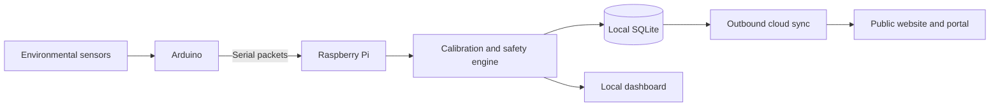

# EDUSENSE ATL — Cloud-Supported Classroom Monitoring

[](https://edusense-ai-schools.ojas-premt2.chatgpt.site)


**EDUSENSE ATL** is a smart-classroom environmental monitoring system that combines an Arduino sensor layer, Raspberry Pi intelligence, local storage, safety classification, and an outbound-only cloud connection.

## Live Website

### [Open the EDUSENSE AI website](https://edusense-ai-schools.ojas-premt2.chatgpt.site)


The current website explains the product for teachers, school leaders, and families; demonstrates the Arduino–Pi–cloud architecture; provides a sanitized interactive sensor explorer; explains calibration and safety states; and includes pilot, support, FAQ, and contact sections.

[Read the complete website feature walkthrough](docs/website-overview.md)

### Current V7 dashboard interface


This is the current V7 interface included by the live website. Earlier uploaded dashboard screenshots remain excluded. The public demo uses fixed sample data and cannot access or control a real classroom device.

## Architecture



## Raspberry Pi Features

- Validates and normalizes incoming Arduino packets
- Manages MQ sensor calibration and rolling baselines
- Converts retained raw ADC readings into estimated PPM values
- Classifies conditions as CALIBRATING, SAFE, ELEVATED, WARNING, or DANGER
- Rejects isolated spikes while detecting sustained rises
- Stores readings and system state locally in SQLite
- Serves a responsive local Flask dashboard
- Provides live, historical, calendar, custom-range, and export APIs
- Sends batched telemetry to the cloud using outbound HTTPS only
- Supports secure device enrollment and a local Wi-Fi setup portal
- Tracks Pi CPU temperature, CPU, RAM, disk, serial, Arduino, and cloud status
- Generates recommendations with deterministic fallback and optional AI providers

## Arduino Features

- Reads DHT22 and six MQ sensor channels
- Sends a complete serial packet every second at 9600 baud
- Rejects partial packets when DHT data is invalid
- Keeps LED and buzzer disabled for the first 200 seconds
- Receives Pi-authoritative SAFE, ELEVATED, WARNING and DANGER commands
- Drives green, cyan/blue, amber and red status colours
- Provides intermittent WARNING and continuous DANGER buzzer patterns

## Repository Layout

```text
raspberry-pi/
├── src/          Core Python application
├── web/          Local dashboard interface
├── tests/        Regression tests
└── requirements.txt
arduino/          Uno reference firmware and execution guide
website/          Current public website preview images
cloud/            Public cloud overview only
docs/             Architecture and logic documentation
libraries/        Dependency overview
```

## Documentation

- [Website preview and full feature walkthrough](docs/website-overview.md)
- [Arduino firmware, wiring and upload guide](arduino/README.md)
- [Raspberry Pi setup and modules](raspberry-pi/README.md)
- [Complete Pi logic and data flow](docs/pi-logic.md)
- [Cloud overview](cloud/README.md)
- [Library overview](libraries/README.md)

## Verification

- All uploaded Python modules compile
- 5 supplied Raspberry Pi regression tests pass
- Arduino source matches the documented pin map, packet protocol, warm-up lockout and command table
- Public-tree and secret-pattern scans completed successfully

## Security and Safety

Databases, records, credentials, Wi-Fi passwords, enrollment tokens, Cloudflare source, private bindings, old screenshots, exports and caches are excluded.

MQ/PPM results are estimates unless calibrated with certified reference gases. EDUSENSE must not replace certified fire, carbon-monoxide, gas, or emergency safety equipment.

## Current Status

The Raspberry Pi application, local dashboard, Arduino Uno reference firmware, current website previews, website feature documentation, cloud overview, and technical documentation are published.
