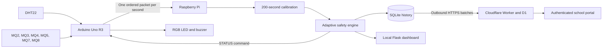

# EDUSENSE AI - Smart Classroom Environmental Monitoring

[](https://edusense-ai-schools.ojas-premt2.chatgpt.site)
[](#verification)
[](#hardware)

EDUSENSE AI is an ATL smart-classroom project that records temperature,
humidity, and six MQ sensor channels, learns a local clean-air baseline, stores
history on a Raspberry Pi, and presents current and historical information on a
local dashboard and an authenticated cloud portal.

This repository is the publication-ready project record. It contains the real
Raspberry Pi application, Arduino reference firmware, Pi installer, Cloudflare
Worker/D1 source, public website source, tests, and documentation. Runtime
databases, credentials, school Wi-Fi details, API keys, enrollment tokens, and
account-specific deployment files are deliberately excluded.

> EDUSENSE is an educational environmental monitor, not a certified fire,
> carbon-monoxide, gas, or life-safety instrument. MQ concentration values are
> estimates unless the installation is calibrated with certified reference gas
> and the complete sensor-resistance model.

## What is real and what is illustrative

- The code, serial protocol, database schema, safety engine, exports, installer,
  cloud API, authentication flow, and regression tests are real project files.
- Repository screenshots are captures of the current EDUSENSE interfaces.
- The public website's classroom scene is an illustrative design asset, not a
  photograph of a deployed classroom.
- The public website demo uses labelled sample data and cannot control hardware.
- No claim in this repository represents an ATL prototype as a certified product.

See [Evidence and asset provenance](docs/EVIDENCE_AND_PROVENANCE.md).

## System architecture



The Pi remains authoritative even when the internet is unavailable. The browser
never calculates status and the cloud never directly controls the classroom LED
or buzzer.

## Hardware

| Component | Connection |
|---|---|
| DHT22 | Arduino D2 |
| MQ2 | A0 |
| MQ3 | A4 |
| MQ4 | A5 |
| MQ5 | A1 |
| MQ7 | A2 |
| MQ8 | A3 |
| Reference RGB LED | D9, D10, D11 |
| Reference buzzer | D8 |
| Arduino to Pi | USB serial, 9600 baud |

The MQ pin map is from the project hardware specification. The published LED
and buzzer assignments belong to the V7 reference firmware and must be checked
against the physical prototype before flashing.

## Core behaviour

1. Arduino reads all sensors and emits one complete packet per second.
2. Pi validates packet order and value ranges.
3. Every reading is stored during the mandatory 200-second calibration.
4. Calibration builds an initial average baseline for each MQ channel.
5. The safety engine filters noise and evaluates relative rise, rate of rise,
   absolute guardrails, persistence, and multi-sensor evidence.
6. The Pi produces CALIBRATING, SAFE, ELEVATED, WARNING, or DANGER.
7. Only after calibration, the Pi sends a status command to the Arduino.
8. SQLite preserves readings and pending cloud uploads across restarts.
9. The cloud client retries outbound batches without stopping local monitoring.

## Repository layout

```text
arduino/                 Arduino Uno V7 reference firmware and upload guide
raspberry-pi/src/        Flask backend, database, safety and synchronization
raspberry-pi/web/        Current local dashboard and offline Chart.js asset
raspberry-pi/tests/      Six regression tests
raspberry-pi/deploy/     Raspberry Pi OS installer and service helpers
cloud/worker/            Cloudflare Worker, D1 migrations and sanitized config
website/source/          Current public EDUSENSE website source and tests
website/images/          Captures of the current interfaces
docs/                    Architecture, journey, deployment and verification
```

## Start here

- [Complete deployment guide](docs/DEPLOYMENT.md)
- [Architecture and data flow](docs/ARCHITECTURE.md)
- [Project journey: prototype to V7](docs/PROJECT_JOURNEY.md)
- [Raspberry Pi module guide](raspberry-pi/README.md)
- [Arduino firmware guide](arduino/README.md)
- [Cloud Worker deployment](cloud/README.md)
- [Public website guide](website/README.md)
- [Verification record](docs/VERIFICATION.md)
- [Third-party software notices](docs/THIRD_PARTY_NOTICES.md)
- [Security policy](SECURITY.md)

## Verification

Verified locally from the publication tree:

- All published Python modules compile.
- Six Raspberry Pi regression tests pass.
- The two-hour history contract permits all 7,200 one-second readings.
- A single 600 ADC spike is rejected while a sustained rise escalates.
- Calibration output reset sends `OUTPUTS:OFF`, not `STATUS:SAFE`.
- Cloud Worker TypeScript type-check and dry-run build complete.
- Public website production build and rendered-route tests complete.
- Secret-pattern and forbidden-runtime-file scans complete before publication.

Exact commands and any tooling limits are recorded in
[docs/VERIFICATION.md](docs/VERIFICATION.md).

## Current interfaces

### Public website


### Raspberry Pi classroom dashboard


## Responsible deployment

Before classroom use, verify the power budget, sensor module output voltage,
common ground, RGB resistors, buzzer driver, enclosure airflow, cable strain
relief, serial reliability, local emergency procedures, and comparison against
appropriate reference instruments. Never use EDUSENSE as the sole basis for an
evacuation or all-clear decision.
