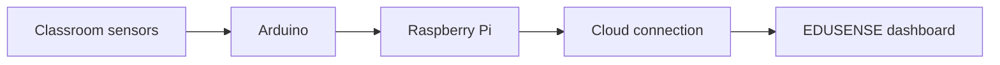

# EDUSENSE ATL — Cloud-Supported Classroom Monitoring

**EDUSENSE ATL** is a smart-classroom environmental monitoring project designed to turn sensor readings into clear, useful information for healthier and more responsive learning spaces.

## Live Website

### [Open the EDUSENSE AI dashboard](https://edusense-ai-schools.ojas-premt2.chatgpt.site)

The public website presents the cloud-connected side of EDUSENSE. It provides a focused dashboard for viewing classroom conditions, device connectivity, safety status, historical trends, and system recommendations.

> This repository currently documents the public website only. Cloudflare source code, credentials, databases, device secrets, and private configuration are intentionally excluded.

## Website Highlights

- Live classroom environment dashboard
- Overall state and device-connection indicators
- Temperature and humidity monitoring
- MQ-series gas sensor readings
- Sensor calibration progress and status
- Live and historical environmental analytics
- Time-range and sensor-category controls
- AI-style safety recommendations
- Stored-reading and previous-session summaries
- Responsive interface for desktop and mobile
- Export-oriented controls for reviewing collected information

## System Concept

The Arduino gathers raw environmental measurements. The Raspberry Pi processes and manages the readings, evaluates system state, and acts as the bridge to the cloud-supported dashboard.

## Documentation

Read the detailed [website overview](docs/website-overview.md).

## Repository Roadmap

This repository will be expanded in stages:

- `raspberry-pi/` — Pi application and setup documentation
- `arduino/` — Arduino firmware and wiring notes
- `cloud/` — public cloud architecture overview only
- `docs/` — architecture, workflow, setup, and device-connection guides
- `libraries/` — dependency and library overview
- `screenshots/` — approved project images

## Security and Privacy

The public repository will not contain:

- Wi-Fi names or passwords
- API tokens or OAuth credentials
- Cloudflare secrets or private bindings
- Device-secret files
- Local databases or classroom records
- Private environment files
- Personal information

## Current Status

Website overview published. Raspberry Pi, Arduino, architecture, and connection documentation will be added after the verified project files are supplied and security-checked.

---

Created by **Ojas Prem** as an ATL smart-classroom environmental monitoring project.
