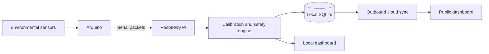

# EDUSENSE ATL — Cloud-Supported Classroom Monitoring

[](https://edusense-ai-schools.ojas-premt2.chatgpt.site)


**EDUSENSE ATL** is a smart-classroom environmental monitoring system that combines an Arduino sensor layer, Raspberry Pi intelligence, local storage, safety classification, and an outbound-only cloud connection.

## Live Website

### [Open the EDUSENSE AI dashboard](https://edusense-ai-schools.ojas-premt2.chatgpt.site)

The public website presents classroom conditions, device connectivity, safety state, historical trends, calibration progress, and recommendations. Cloudflare implementation details and private account configuration are not included in this repository.

## Architecture



## Raspberry Pi Features

- Validates and normalizes incoming Arduino packets
- Manages MQ sensor calibration and rolling baselines
- Converts retained raw ADC readings into estimated PPM values
- Classifies conditions as CALIBRATING, SAFE, ELEVATED, WARNING, or DANGER
- Rejects isolated spikes while detecting sustained rises
- Stores readings and system state locally in SQLite
- Serves a responsive local Flask dashboard
- Provides live, historical, calendar, custom-range, and export APIs
- Sends batched telemetry to the cloud using outbound HTTPS only
- Supports secure device enrollment and a local Wi-Fi setup portal
- Tracks Pi CPU temperature, CPU, RAM, disk, serial, Arduino, and cloud status
- Generates recommendations with deterministic fallback and optional AI providers

## Repository Layout

```text
raspberry-pi/
├── src/          Core Python application
├── web/          Local dashboard interface
├── tests/        Regression tests
└── requirements.txt
cloud/            Public cloud overview only
docs/             Architecture and logic documentation
libraries/        Dependency overview
arduino/          Reserved for verified Arduino firmware
```

## Documentation

- [Raspberry Pi setup and modules](raspberry-pi/README.md)
- [Complete Pi logic and data flow](docs/pi-logic.md)
- [Website overview](docs/website-overview.md)
- [Cloud overview](cloud/README.md)
- [Library overview](libraries/README.md)

## Verification

The supplied code passed:

- Python compilation for every uploaded module
- 5 regression tests covering PPM/API shape, CSV fields, two-hour history, full database history, and spike rejection versus sustained escalation
- Secret-pattern scan

## Security

Excluded from this public repository:

- SQLite databases and classroom records
- Wi-Fi credentials
- device credential files and enrollment tokens
- API keys and OAuth secrets
- Cloudflare source code and private bindings
- old dashboard screenshots, exports, caches, and compiled files

## Current Status

The Raspberry Pi application and its local dashboard are published. The Arduino folder will be added only after verified firmware is supplied.
