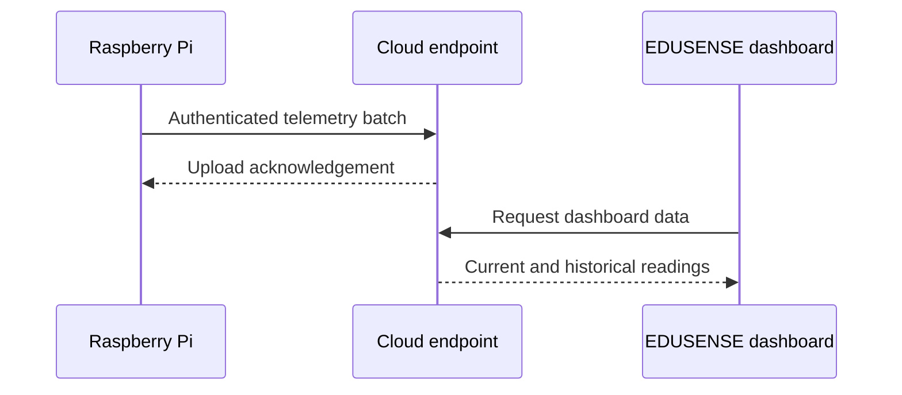

# Cloud Overview

Live website: [EDUSENSE AI](https://edusense-ai-schools.ojas-premt2.chatgpt.site)

The cloud-supported layer receives authenticated telemetry batches from enrolled classroom devices and presents approved environmental information through the public dashboard.

## Publicly Documented Flow

The Raspberry Pi remains authoritative for local collection, calibration, safety classification, and storage. Network or cloud failures do not stop local processing.

## Intentionally Excluded

- Cloudflare Worker/Page source code
- account identifiers and private bindings
- databases and classroom telemetry
- enrollment codes and device secrets
- API tokens and OAuth credentials
- production environment configuration
