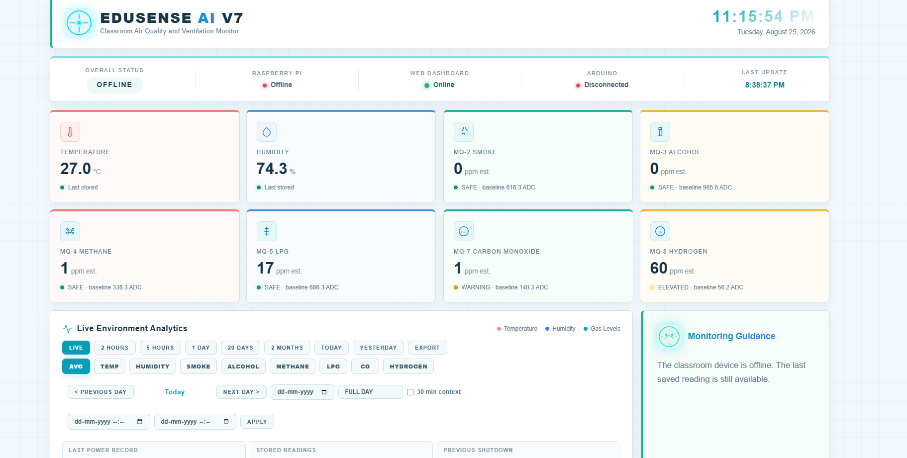

# EDUSENSE AI Website — Current Feature Walkthrough

## Live links

- [Open the EDUSENSE AI public website](https://edusense-ai-schools.ojas-premt2.chatgpt.site)
- [Open the EDUSENSE cloud portal](https://edusense-cloud.ojasprm.workers.dev/portal)

The public website is the presentation and demonstration layer for EDUSENSE. It explains the product, shows how the Arduino, Raspberry Pi, and cloud layers work together, and provides a sanitized interactive dashboard demonstration. It does not expose Cloudflare source code, private endpoints, credentials, database contents, or device secrets.

## Current website preview

## Current EDUSENSE V7 interface

The second image is the current V7 interface shown by the website itself. The older dashboard screenshots supplied earlier are intentionally excluded.

## What visitors can explore

### Product introduction

The hero introduces the goal: **“See the room. Protect the learning.”** It presents EDUSENSE as a local-first environmental intelligence system for schools. The opening trust points emphasize privacy by design, local processing, and real-time response.

The website highlights these system facts:

| Capability | Website explanation |
| --- | --- |
| Sensor interval | One complete sensor packet per second |
| Gas channels | Six MQ channels: MQ-2, MQ-3, MQ-4, MQ-5, MQ-7, and MQ-8 |
| Safety model | SAFE, ELEVATED, WARNING, and DANGER |
| Processing | Decisions are made locally by the Raspberry Pi |

### Product capabilities

Four feature cards explain the core value:

- **Continuous sensing:** classroom conditions are sampled continuously instead of relying on occasional manual checks.
- **Baseline-aware checks:** MQ readings are interpreted against calibration baselines rather than treated as universal values.
- **Actionable response:** safety states are translated into understandable guidance and physical LED/buzzer commands.
- **Evidence over time:** stored readings and trends help schools review environmental behaviour instead of seeing only one instant value.

### Views for different school users

An interactive audience selector changes the explanation for:

- **Teachers:** simple current condition and useful next steps.
- **School leaders:** trends, evidence, and system status across the installation.
- **Families:** clear, privacy-conscious communication about the classroom environment.

### Sample campus overview

The website contains a visual sample overview that demonstrates how room condition, connection state, and recent environmental information could be presented. It is illustrative and does not expose a real school deployment.

### Technology explorer

Visitors can switch between three system layers:

| Layer | Responsibility |
| --- | --- |
| Arduino Uno | Reads DHT22 and MQ sensors, sends serial packets, and obeys Pi status commands |
| Raspberry Pi | Validates readings, calibrates sensors, stores history, classifies safety, and controls outputs |
| Cloud portal | Presents approved synchronized information without taking over local safety decisions |

The website also explains the operating sequence: **Sense → Transfer → Interpret → Respond**.

### Calibration and safety explanation

The site explains why MQ sensors require a warm-up and clean-air baseline before decisions are enabled. It also introduces the four operational states:

- **SAFE:** readings remain within the learned normal range.
- **ELEVATED:** a meaningful rise is present and should be watched.
- **WARNING:** a sustained or stronger rise requires attention.
- **DANGER:** the highest local alert state; the Pi commands the physical warning outputs.

The Arduino does not calculate these states. The Raspberry Pi remains authoritative.

### Interactive dashboard demonstration

The demo uses fixed, sanitized sample data. Visitors can:

- inspect temperature, humidity, and six gas channels;
- switch among MQ-2 smoke, MQ-3 alcohol vapour, MQ-4 methane, MQ-5 LPG, MQ-7 carbon monoxide, and MQ-8 hydrogen;
- change example time ranges such as LIVE, 2 hours, 1 day, and 20 days;
- review status explanations, analytics, and recommended actions;
- see how the interface responds on desktop and mobile layouts.

The public demo is not connected to a real classroom, Raspberry Pi, Arduino, database, or safety equipment. Its controls cannot operate physical devices.

### Pilot, support, and contact

The website includes a pilot pathway, support information, frequently asked questions, and a contact form. Navigation links take visitors directly to Product, For Schools, Technology, Pilot, Demo, and Support sections. A compact mobile menu provides the same destinations on smaller screens.

## Relationship to the repository

| Part | Location |
| --- | --- |
| Raspberry Pi application and full decision logic | `raspberry-pi/src/` |
| Local Raspberry Pi dashboard | `raspberry-pi/web/` |
| Arduino Uno reference firmware | `arduino/` |
| Website screenshots and public explanation | `website/` and this document |
| Cloud public overview only | `cloud/` |

The public website source is intentionally not copied into this repository. Only the live link, current authorized preview images, and a feature-level explanation are published.

## Safety limitation

MQ readings and converted PPM values are estimates unless the installation is calibrated with appropriate certified reference gases and sensor resistance models. EDUSENSE is an educational monitoring system and must not replace certified fire alarms, carbon-monoxide alarms, gas detectors, or emergency safety equipment.
